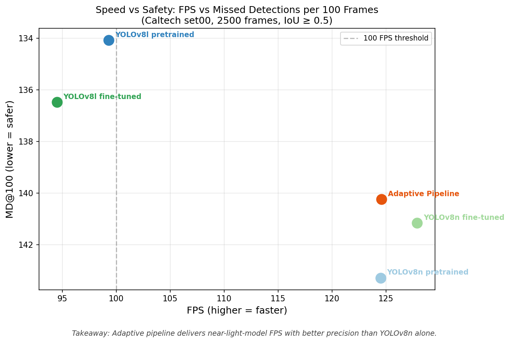
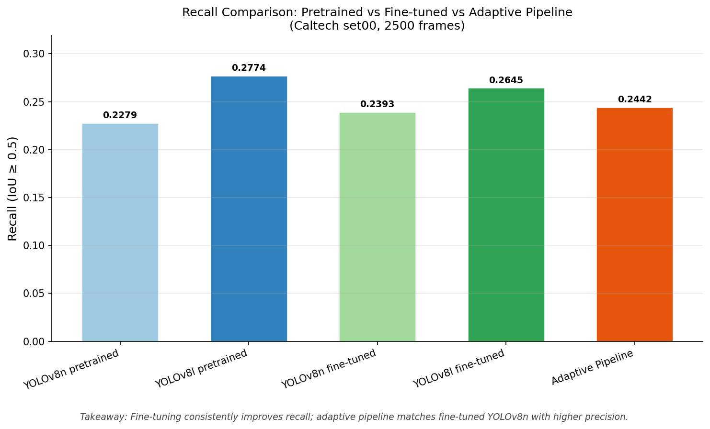
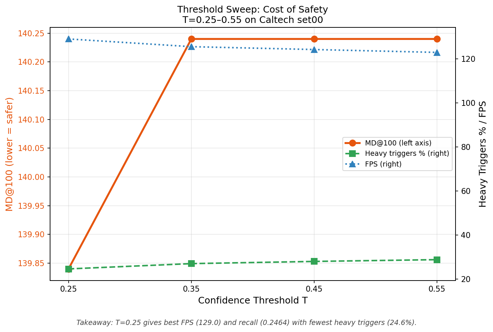

# Adaptive Inference Router: Confidence-Based Model Selection for Real-Time Object Detection

Speed and accuracy are usually presented as a binary choice in object detection. Run a heavy model and get reliable detections at 94 FPS. Run a lightweight model and get 128 FPS but miss more pedestrians. Most deployed systems just pick one and accept the tradeoff.

This project asks a different question: what if the system could decide, frame by frame, when accuracy matters enough to spend the extra compute?

---

## What This Project Builds

The pipeline runs a fine-tuned YOLOv8n on every frame. When it looks uncertain — low detection confidence, a pedestrian streak that suddenly drops, or a very small box indicating a far-away person — it escalates that frame to YOLOv8l. The heavy model's result replaces the light model's result for that frame only. Everything else gets YOLOv8n's answer.

The result is a system that runs at 124.6 FPS GPU inference throughput while achieving 0.8655 precision — the highest of any configuration tested, including running YOLOv8l alone at full cost. On a dense sequence (V001, 7,303 pedestrian instances), heavy model invocation rises to 56.2% of frames and throughput settles at 83.4 FPS — still well above real-time requirements.

Precision is the real result of this project. The scheduler is not a recall recovery mechanism. Recall improves slightly over YOLOv8n fine-tuned (0.2464 vs 0.2393 at T=0.25) but does not reach YOLOv8l fine-tuned recall (0.2645) — that gap is expected in cascaded systems where the base models are architecturally similar. What the scheduler does achieve is a meaningful precision gain: by invoking the heavy model selectively on uncertain frames, it filters out the low-confidence detections that the light model would otherwise emit, raising the trustworthiness of every detection in the output stream.

---

## The Domain Gap Problem

Both models were pretrained on COCO, which underrepresents dense urban pedestrian scenarios from a vehicle-mounted camera perspective. Running pretrained YOLOv8n on Caltech Pedestrian driving footage produces 22.8% recall. YOLOv8l pretrained gets 27.7%. These numbers are low — but they are honest, and they quantify exactly how much the COCO-to-driving-video domain shift costs.

Fine-tuning both models on CrowdHuman closed that gap. CrowdHuman was specifically chosen because it contains the hard cases: dense crowds, heavy occlusion, overlapping people. On CrowdHuman validation, recall jumped from a pretrained baseline of roughly 28% to 79.2% for YOLOv8l and 70.2% for YOLOv8n. The models learned to handle the hard cases.

On Caltech evaluation after fine-tuning, the improvement is more modest because set00 — the evaluation sequence used here — is relatively sparse and clean. The scheduler's precision advantage is most visible on dense sequences: on V001, which contains 7,303 pedestrian instances, the heavy model fires on 56.2% of frames to keep up with the scene complexity.

---

## Results

All numbers measured on Caltech Pedestrian set00, 2,500 frames, IoU threshold 0.5. FPS figures reflect GPU inference throughput on A100 (model forward pass + NMS), not end-to-end pipeline latency.

| Configuration              | FPS   | Recall | Precision  | MD@100 | Miss Rate (partial occlusion) |
| -------------------------- | ----- | ------ | ---------- | ------ | ----------------------------- |
| YOLOv8n pretrained         | 124.5 | 0.2279 | 0.7671     | 143.28 | 0.9455                        |
| YOLOv8l pretrained         | 99.3  | 0.2774 | 0.7602     | 134.08 | 0.9126                        |
| YOLOv8n fine-tuned         | 127.9 | 0.2393 | 0.7317     | 141.16 | 0.9270                        |
| YOLOv8l fine-tuned         | 94.5  | 0.2645 | 0.8319     | 136.48 | 0.9228                        |
| Adaptive Pipeline (T=0.35) | 124.6 | 0.2442 | **0.8655** | 140.24 | 0.9372                        |

MD@100 is missed detections per 100 frames — a deployment-oriented metric that reflects how many pedestrians a system silently ignores per unit of video processed.

The adaptive pipeline does not match YOLOv8l fine-tuned recall — it sits between the two models, which is expected behavior. What it does achieve is the highest precision across all configurations while running at near-light-model throughput. When the system emits a detection, it is more likely to be correct than any other configuration tested.


---

## Plots

### Speed vs Safety — FPS vs MD@100



### Recall Comparison across Configurations



### Threshold Sweep — Cost of Being Safer



---

## Threshold Sweep

The confidence threshold T controls how aggressively the scheduler escalates to the heavy model. Lower T means the light model needs to be very confident before the heavy model is skipped.

| T    | FPS   | Recall | MD@100 | Heavy Model Triggered |
| ---- | ----- | ------ | ------ | --------------------- |
| 0.25 | 129.0 | 0.2464 | 139.84 | 24.6%                 |
| 0.35 | 125.5 | 0.2442 | 140.24 | 27.0%                 |
| 0.45 | 124.2 | 0.2442 | 140.24 | 28.0%                 |
| 0.55 | 122.9 | 0.2442 | 140.24 | 28.8%                 |

T=0.25 is the best operating point: highest recall, highest FPS, fewest heavy model invocations. The scheduler at this threshold is genuinely selective — it escalates only the frames where escalation is warranted, not as a reflexive fallback.

---

## Pipeline Logic

```
Input Frame
     |
     v
YOLOv8n fine-tuned (every frame)
     |
     |-- All detections high confidence, normal box sizes, no streak break
     |   --> Use YOLOv8n result directly
     |
     |-- Any trigger fires:
     |   - Any detection confidence < T
     |   - No detection after 3+ consecutive frames with detections
     |   - Any box covers < 1% of image area (far pedestrian)
     |        |
     |        v
     |   YOLOv8l fine-tuned (this frame only)
     |        |
     |        v
     |   Use YOLOv8l result
     v
Final detection output
```

The three trigger conditions target different failure modes. Low confidence catches frames where the light model is uncertain about what it sees. The streak break condition catches frames where a pedestrian was tracked for multiple frames and then disappears — which is more likely a missed detection than the pedestrian actually leaving the scene. The small box condition catches far-away pedestrians, which are disproportionately missed by lighter models.

---

## Training Setup

Both models were fine-tuned identically to keep the comparison fair:

- Dataset: CrowdHuman (15,000 train / 4,370 val images)
- Annotations: full-body bounding boxes (fbox), ignore=1 crowd regions filtered out
- Epochs: 30, batch size: 32, image size: 640
- Hardware: NVIDIA A100-SXM4-80GB
- Training time: approximately 1-2 hours per model

CrowdHuman validation metrics after fine-tuning:

| Model              | Recall | Precision | mAP50  |
| ------------------ | ------ | --------- | ------ |
| YOLOv8n fine-tuned | 0.7017 | 0.8487    | 0.8155 |
| YOLOv8l fine-tuned | 0.7922 | 0.8717    | 0.8792 |

---

## Datasets

**CrowdHuman** was used for fine-tuning. It contains 470K annotated human instances across 15,000 training images, with an average of 23 persons per image. The density and occlusion characteristics directly target the failure modes that COCO-pretrained models struggle with.

**Caltech Pedestrian** was used for evaluation. It is real video captured from a moving vehicle in urban traffic, recorded at 30 FPS with per-instance occlusion labels. Evaluating on a dataset completely separate from training tests whether the improvements generalize to actual deployment conditions rather than just measuring benchmark performance.

---

## Why This Matters for Deployed Systems

Every AV and drone perception system has a compute budget. The standard industry response is to deploy a lighter model and accept the accuracy drop. This project demonstrates a third option: spend compute selectively, on the frames that actually need it.

The concrete outcome is controlled. On a typical driving sequence, the heavy model runs on roughly 25% of frames, keeping throughput at near-light-model speed. On a dense, crowded sequence it runs on 56% of frames — because the scene genuinely requires it. The scheduler is not a fixed compute saver; it is a scene-aware allocator that adjusts to what is actually happening in the video.

The approach is architecture-agnostic. The same scheduler logic applies to any pair of fast and accurate models, and the threshold T is a single tunable parameter. Raise T to save compute; lower T to be more conservative. The tradeoff is explicit and measurable, which is what matters for real deployment decisions.

---

## Project Structure

```
adaptive-pedestrian-detection/
|
|-- data/
|   |-- caltech/                  # .seq files, .vbb annotations, extracted frames
|   `-- crowdhuman/               # train/val images, .odgt annotations
|
|-- data/crowdhuman_yolo/         # converted YOLO format dataset
|
|-- src/
|   `-- scheduler.py              # AdaptiveScheduler class
|
|-- experiments/
|   |-- run_baseline.py           # pretrained model eval
|   |-- run_finetuned_eval.py     # fine-tuned model eval
|   |-- run_adaptive.py           # adaptive pipeline eval
|   |-- sweep_thresholds.py       # T sweep across 0.25-0.55
|   `-- plot_results.py           # all three plots
|
|-- results/
|   |-- full_comparison.csv
|   |-- sweep_results.csv
|   `-- figures/                  # plot1, plot2, plot3
|
|-- demo/
|   |-- demo_video.py
|   `-- adaptive_demo.mp4         # 16.7s demo, light/heavy switching visible
|
`-- README.md
```

---

## Tech Stack

Python 3.10, PyTorch 2.10, Ultralytics YOLOv8, OpenCV, NumPy, Pandas, Matplotlib, SciPy. Hardware: NVIDIA A100-SXM4-80GB.

---

## References

- Shao et al., "CrowdHuman: A Benchmark for Detecting Human in a Crowd", arXiv 2018
- Dollar et al., "Pedestrian Detection: An Evaluation of the State of the Art", PAMI 2012
- Ultralytics YOLOv8, 2023
